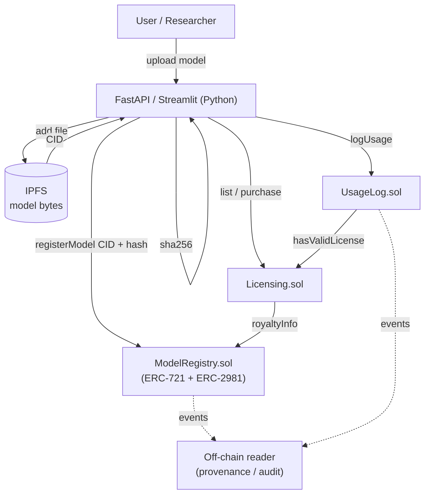
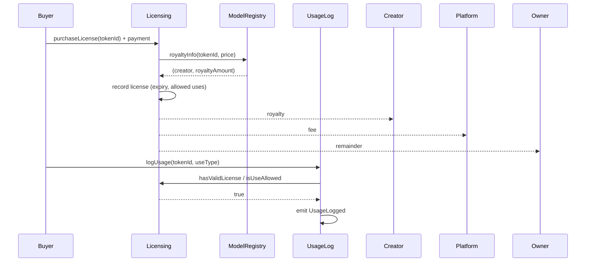

# Architecture

## Mental model

Three roles, three technologies:

| Role | Technology | Responsibility |
|---|---|---|
| **Notary + cashier** | Ethereum smart contracts (Solidity) | Immutable records: ownership, provenance, licensing terms, royalty splits, usage audit trail |
| **Warehouse** | IPFS | Stores the actual (large) model files, content-addressed by CID |
| **Clerk** | Python (web3.py + FastAPI + Streamlit) | Moves data between user ↔ IPFS ↔ chain; hashes files; drives benchmarks |

The key design decision: **only metadata goes on-chain.** Model bytes are far too large and expensive to
store on a blockchain, so the chain stores a *content id* (where the file is) plus a *SHA-256 hash* (proof
the file wasn't changed). This split is what makes the system practical and is the core research contribution.

## System overview

## Contracts and how they connect

- **`ModelRegistry.sol`** — each model is an ERC-721 NFT (unambiguous ownership). Stores `ipfsCID`,
  `sha256Hash`, `version`, timestamps, `creator`. ERC-2981 attaches a royalty percentage per token.
  `verify(tokenId, hash)` is the integrity check.
- **`Licensing.sol`** — reads ownership + `royaltyInfo` from the registry. `purchaseLicense` splits the
  payment three ways (creator royalty / platform fee / owner) and records a time-bounded license with an
  allowed-use-types bitmask.
- **`UsageLog.sol`** — `logUsage` is gated by `Licensing.hasValidLicense` + `isUseAllowed`; emits an
  event per use. The audit trail is reconstructed from events, keeping per-call gas minimal.

## Purchase-and-use sequence

## Trust & threat notes (for the thesis)

- **Integrity** is guaranteed *cryptographically*, not by trusting the platform: any party can re-hash a
  downloaded file and compare on-chain. Tampering is detectable by construction.
- **Ownership/provenance** is enforced by the NFT + event history (immutable once mined).
- **Availability** depends on IPFS pinning — a file whose providers all go offline is unreachable even
  though its record persists. This is a known limitation to discuss (mitigation: pinning services / Filecoin).
- **Royalty enforcement** here is enforced *inside our Licensing contract*; ERC-2981 alone is only a
  signal that arbitrary marketplaces may ignore. Worth stating explicitly in the write-up.
